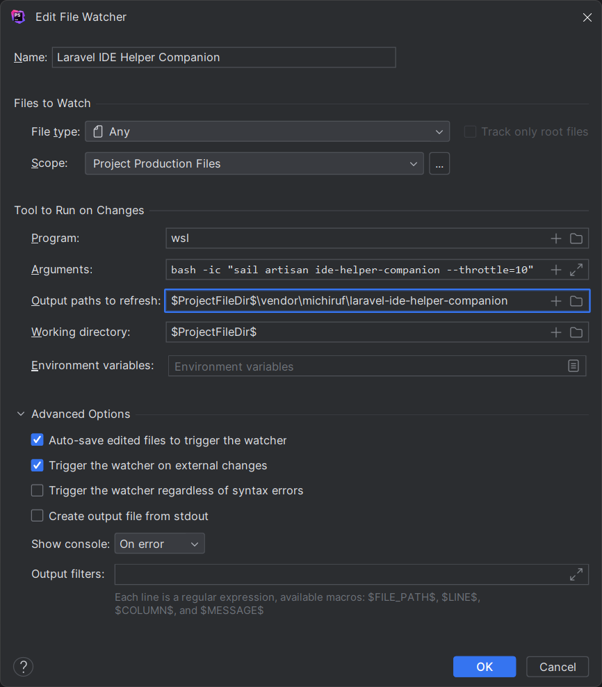

# Laravel IDE Helper Companion

[](https://github.com/michiruf/laravel-ide-helper-companion/actions/workflows/run-tests.yml)

This is a zero configuration package around [barryvdh / laravel-ide-helper](https://github.com/barryvdh/laravel-ide-helper).
Which aims to integrate easily with PHPStorm.

## Installation

1. Add the github repository and the dev dependency in your composer.json like so:
   ```json5
   {
       // ...
       "repositories": [
           {
               "type": "vcs",
               "url": "https://github.com/michiruf/laravel-ide-helper-companion.git"
           }
       ],
       "require-dev": {
           // ...
           "michiruf/laravel-ide-helper-companion": "dev-main",
           // ...
       }
   }
   ```
2. Perform a composer update for the package
   ```shell
   composer update michiruf/laravel-ide-helper-companion
   ```
   
## Usage

Command:
```shell
php artisan ide-helper-companion
```

Command for a file watcher:
```shell
php artisan ide-helper-companion:throttled 10
```
will execute the command only every 10 seconds, and also will retry the current execution after 10 seconds.

### Example file watcher for WSL and laravel sail



## License

The MIT License (MIT). Please see [License File](LICENSE.md) for more information.
